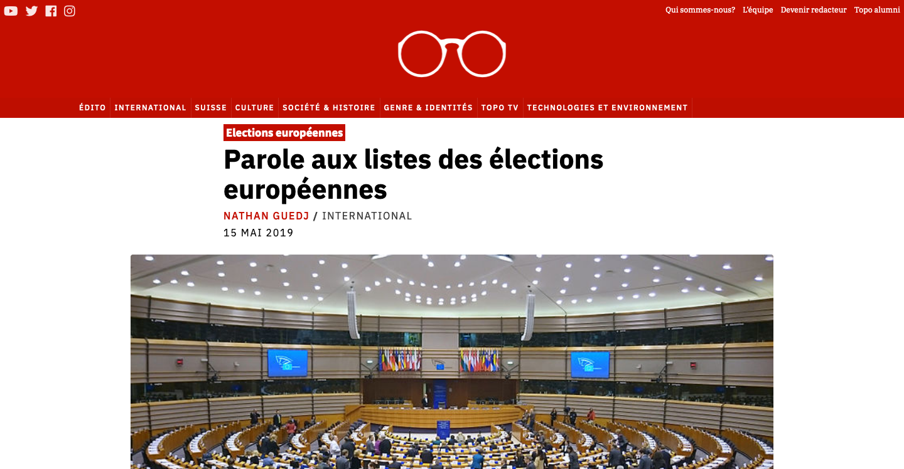

Thème Wordpress pour [topolitique.ch](http://topolitique.ch)
=====

## Structure :

**PHP**

-   En-tête : `header.php`
-   Bas de page : `footer.php`
-   Commentaires : `comments.php`
-   Index: `homepage.php` articles par section, on peut ajouter ou
    enlever des sections... #TODO: changer à `home.php`
-   Derniers articles: `index.php` (index par défaut, replacé par
    topoindex.php) -> '/latest'
-   Catégorie:  `archive.php` : '/category/\<...>'
-   Article: `single.php`
-   Rédacteurs: `author.php` (avec l'extension co-authors plus)
-   Erreur 404: `404.php`
-   Page spéciale : `page.php`
-   Page pour l'équipe : `team.php`

**STYLES**

Le style du site est construit avec sass. Tous les fichiers de base se trouvent dans `scss/` et sont compilés vers `main.css`. Pour compiler le style, faites comme ceci:

1) `npm install` ou `yarn install`
2) `npm run build` ou `yarn build`
3) Pour développer: `npm run serve` ou `yarn serve`, les mises à jour du style se feront en __real time__ 

**fonctions**

-   `functions.php` : si on veut ajouter des menus (pour l'instant:
    Primary=catégories, Secondary=autres liens)
-   `inc/customizer.php` : pour ajouter des champs dans l'onglet de
    personnalisation admin
-   `js/customizer.js` : pour mettre à jour le **customizer** en temps
    réel
-   `inc/template-functions.php` : pas utilisé
-   `inc/template-tags.php` : référence pour des balises genre
    `topolitik_posted_on()` pour afficher la date de l'article

-------

## TODO:

-   Inclure des PDF ou 'carousel' pour certains articles
-   Base pour scss, le résultat se trouvant sur "main.css" ✌️

✍️ = entrain de bosser dessus
✌️ = pas mal
👌 = top
